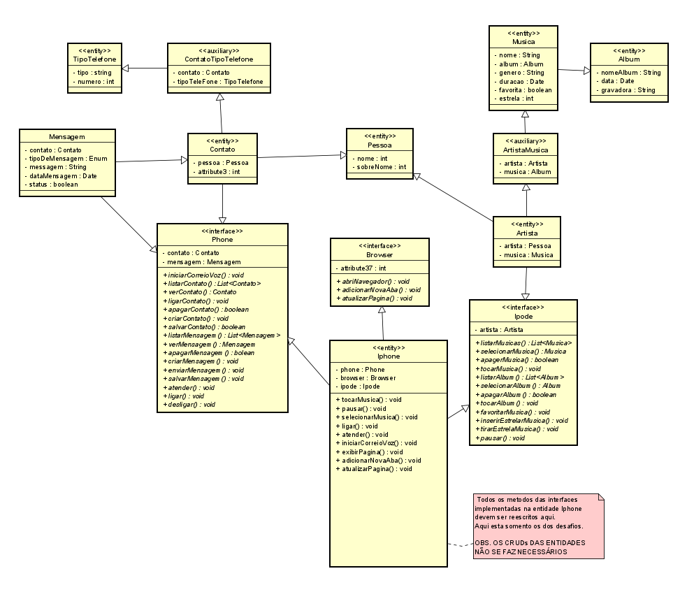

# Projeto JAVA DIO - Trilha Java POO

- Este projeto visa colocar em pratica os conceitos adquiridos na Trilha Java Básico.

---

## DESAFIO - POO 

- 

## Este projeto contempla os assuntos.

- [x] Modelagem e Diagramação de um Componente iPhone
- [x] Reprodutor Musical
    - Métodos: tocar(), pausar(), selecionarMusica(String musica)
- [x] Aparelho Telefônico
    - Métodos: ligar(String numero), atender(), iniciarCorreioVoz()
- [x] Navegador na Internet
    - Métodos: exibirPagina(String url), adicionarNovaAba(), atualizarPagina()
---

## Diagrama de classe simplificado baseado no [video IPHONE](https://www.youtube.com/watch?v=9ou608QQRq8)

##### Meu contato.

